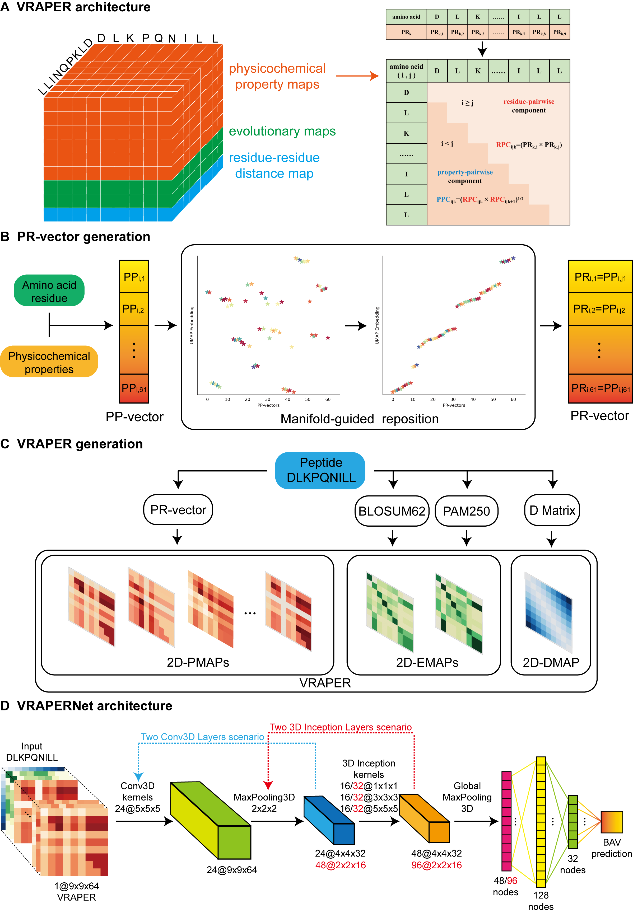

# VRAPER & VRAPERNet

### Deep Learning Volumetric Residue-Aligned Physicochemical Evolutionary Representations of Peptides for Enhanced MHC-I Binding Affinity Quantification

## VRAPER generation & VRAPERNet architecture

## Usage
1.Due to limitations on GitHub, this repository only pushes files smaller than 10M.
Files larger than 10M of dataset and model files can be downloaded using the link in the corresponding directory's  `readme.md`
